# V2EX Max Helper

> V2EX 一站式自动助手：**每日签到** + **自动阅读刷活跃度** + **Telegram Bot 上报/远程控制**。

[](LICENSE)


纯 Node.js 实现，可部署在任意 VPS 上挂机运行。包含两个相互独立、可单独使用的模块：

| 模块 | 目录 | 作用 |
|------|------|------|
| 签到 | [`checkin/`](checkin/) | 每日自动签到、保活心跳防 Session 过期、Cookie 失效推送告警 |
| 阅读 + Bot | [`reader/`](reader/) | Playwright 自动阅读帖子刷活跃度铜币、SQLite 去重队列、Telegram Bot 命令上报 |

---

## 📖 V2EX 活跃度奖励机制

> 如果你已熟悉 V2EX 的铜币系统，可跳过本节。

V2EX 每天会根据用户的**浏览行为**自动发放铜币奖励（通常两轮、每轮数枚），不需要手动领取。
只要在当天使用**已登录的浏览器**访问一定数量的帖子，系统就会把铜币直接加到余额里——
这就是本项目「自动阅读」模块所做的事：**用真实浏览器读帖子，触发活跃度奖励**。

签到奖励则是另一个独立的每日任务（`/mission/daily`），需要主动领取。

---

## ✨ 功能特性

- ✅ **每日签到**：自动领取每日登录奖励，记录连续签到天数，支持失败重试。
- 🔄 **登录态自动续期**：捕获服务端响应的 `Set-Cookie` 并写回本地，利用 V2EX 的滑动续期机制持续延长 `A2` 登录有效期，**正常情况无需反复重新登录**（签到 / 保活 / 阅读三条链路均自动续期）。
- 🔁 **保活心跳**：每 6 小时访问首页，定期触发上述登录态续期，避免长期闲置导致 Cookie 自然过期。
- 📖 **自动阅读**：真实浏览器（Playwright）阅读帖子刷活跃度铜币，**拟人随机化**——停留时长偏态分布（多数偏短、偶尔长读）、帖子间随机间隔、阅读时随机滚动页面，参数可调。
- 🗃️ **智能队列**：SQLite（sql.js 纯 JS 版）多源抓取 + 去重，每帖最多读 3 次，自动清理旧记录。
- 🛑 **多重停止条件**：余额变化达标 / 阅读量上限 / 超时窗口，任一触发即安全退出。
- 🤖 **Telegram Bot**：`/sou` 查余额、`/debug` 看报错、`/stop` 远程停止，**硬锁授权 Chat ID**。
- 📢 **推送告警**：Cookie 失效、活跃度奖励、阅读完成均可推送至 Telegram / Bark。
- 👥 **多账号 + 指纹隔离**：通过 `V2EX_PROFILE` 隔离多账号的 Cookie、浏览器数据与**确定性指纹**（UA/视口/时区/语言/硬件/WebGL），降低账号关联风险。详见 [`docs/多账号与指纹隔离.md`](docs/多账号与指纹隔离.md)。
- 🔒 **隐私优先**：所有 Token、Chat ID、Cookie 均从环境变量或本地文件读取，**不写入代码**。

---

## 🔄 工作流程

```mermaid
flowchart TD
    subgraph 签到模块
        A[签到 timer 触发<br/>每日 09:10] --> B[读取 Cookie]
        B --> C{已签到?}
        C -- 否 --> D[签到 + 查余额]
        C -- 是 --> E[跳过]
        D --> F[写回续期 Cookie]
    end

    subgraph 保活模块
        G[Ping timer 触发<br/>每 6 小时] --> H[访问首页]
        H --> I[写回续期 Cookie]
    end

    subgraph 阅读模块
        J[阅读 timer 触发<br/>每日 01:15 UTC<br/>约北京时间 09:15] --> K[启动 Playwright]
        K --> L[注入指纹 + Cookie]
        L --> M[从队列取帖子]
        M --> N[读帖<br/>随机停留+滚动]
        N --> O{检查停止条件}
        O -- 余额变化≥2 --> P[安全退出 ✅]
        O -- 篇数达上限 --> P
        O -- 超时 UTC 06:00 --> P
        O -- 否 --> M
    end

    subgraph Bot
        Q[Telegram 长轮询] --> R{命令?}
        R -- /sou --> S[返回余额]
        R -- /debug --> T[返回最新报错]
        R -- /stop --> U[SIGTERM 阅读进程]
    end
```



---

## 🚀 部署

提供两种部署方式，任选其一。

**前置**：一台 Linux VPS（Debian/Ubuntu 最省心）+ Node.js 18+，能访问 `www.v2ex.com`。

| 使用场景 | 内存 | Swap | 说明 |
|----------|------|------|------|
| **仅签到 + 保活** | 512 MB | 可选 | 纯 HTTP 请求，几乎不吃资源 |
| **签到 + 自动阅读** | **1 GB** | **建议 1 GB** | Chromium 峰值约 400~700 MB，**务必配 Swap** |
| **签到 + 自动阅读（推荐）** | **2 GB** | 可不开 | 运行稳定 |

---

### 方式一：AI Agent 辅助部署（推荐）

让 AI 编程助手代你完成部署：**Agent 负责装环境 / 依赖 / 配置，你只在最后手动填 Token、存 Cookie**。

- 门槛极低：一台能访问 V2EX 的普通小鸡 + 约 5 Mbps 网络即可。
- ✅ **推荐工具**：付费首选 **Claude Pro**；想免费用 **Antigravity（Google Antigravity，<https://antigravity.google>）**，Google 账号 Free 计划即可调用 Claude Opus 4.6 等模型。
- ⚠️ **安全**：启动 Agent 时用官方直连 API，不要经过第三方「中转站」；Cookie、Token 留到最后由你本人手动写入。

完整流程与可复制的提示词模板见 [`docs/Agent辅助部署.md`](docs/Agent辅助部署.md)。

---

### 方式二：一键部署脚本

在 Linux VPS 上以 **root** 执行，自动完成 8 个步骤：装 Node.js → 拉取项目 → 装依赖（含 Chromium/xvfb）→ 引导粘贴 Cookie → 配好 systemd 定时任务 → 可选安装 Bot → 输出组件状态摘要。

```bash
bash <(curl -fsSL https://raw.githubusercontent.com/mskatoni/v2ex-max-helper/main/scripts/install.sh)
```

> 用 `bash <(curl ...)` 而非 `curl | bash`，这样脚本才能正常接收你的**交互输入**（粘贴 Cookie、选择是否装阅读模块和 Bot）。

可选环境变量（写在命令前面即可）：

```bash
# 多账号：为指定 profile 部署
V2EX_PROFILE=acc2 bash <(curl -fsSL https://raw.githubusercontent.com/mskatoni/v2ex-max-helper/main/scripts/install.sh)

# 只装签到+保活，不装自动阅读（省内存）
SKIP_READER=1 bash <(curl -fsSL https://raw.githubusercontent.com/mskatoni/v2ex-max-helper/main/scripts/install.sh)
```

脚本跑完后：

```bash
systemctl list-timers 'v2ex-*'        # 查看定时器
journalctl -u v2ex-checkin -n 50      # 查看签到日志
```

> [!WARNING]
> **签到脚本（`checkin/v2ex-checkin.js`）不读取 `~/.v2ex_env` 文件**，只认进程环境变量。
> 想给签到配 Telegram/Bark 推送，需要在 systemd service 的 `Environment=` 里直接传入
> `TG_BOT_TOKEN`/`TG_CHAT_ID`/`BARK_URL`，或在命令行前缀传入。
> 阅读模块（`reader/`）才会自动读取 `~/.v2ex_env`。详见 [`docs/配置说明.md`](docs/配置说明.md)。

---

## 🧪 测试与调试

部署后建议先用以下方式验证，确认无误再挂机：

```bash
# 签到：立即签到测试
cd ~/v2ex-max-helper/checkin
node v2ex-checkin.js

# 保活：测试心跳
node v2ex-checkin.js --ping

# 阅读：干跑模式（不启动浏览器，只验证流程）
cd ~/v2ex-max-helper/reader
node main.js --dry-run

# 阅读：限制只读 5 篇（真实浏览器，快速验证）
node main.js --limit 5

# 余额调试：打印 /balance 页面解析结果
node inspect_balance.js
```

| 参数 | 说明 |
|------|------|
| `--dry-run` | 跳过浏览器启动和真实请求，只跑调度逻辑验证流程 |
| `--limit N` | 最多读 N 篇后停止（覆盖默认的 1000 篇上限），同时禁用截止时间检查 |
| `--ping` | 签到脚本的保活模式，只访问首页刷新登录态 |
| `--save-cookie` | 将 `V2EX_COOKIE` 环境变量的值保存到本地 Cookie 文件 |

---

## 🤖 Telegram Bot 命令

| 命令 | 说明 |
|------|------|
| `/sou` | 查询今日 / 昨日余额（铜币）记录 |
| `/debug` | 查看阅读脚本最近的报错日志 |
| `/stop` | 远程停止正在运行的阅读脚本 |

Bot 通过 `TG_CHAT_ID` **硬锁授权**，只响应你本人的消息，其他人无法控制。

### 安装 Bot

Bot 是常驻进程。**一键部署脚本**在 Step 7/8 会交互式询问是否安装；也可事后手动安装：

```bash
sudo bash scripts/install-systemd.sh --bot   # 安装 Bot 常驻 service
systemctl status v2ex-bot                     # 查看状态
```

> 前提：确保 `~/.v2ex_env` 中已填入 `TG_TOKEN` 和 `TG_CHAT_ID`。

---

## 📁 目录结构

```
v2ex-max-helper/
├── checkin/                 # 签到模块
│   ├── v2ex-checkin.js      # 签到 + 保活主程序（v1.3.0）
│   └── package.json
├── reader/                  # 自动阅读 + Bot 模块
│   ├── main.js              # 阅读主调度器（支持 --dry-run / --limit）
│   ├── bot.js               # Telegram Bot 命令处理器（常驻进程）
│   ├── notify.js            # 推送通知（Telegram / Bark）
│   ├── browser.js           # Playwright 浏览器控制 + 拟人随机化
│   ├── fetcher.js           # 帖子 URL 多源抓取（/recent 多页 + 分区）
│   ├── balance.js           # 余额监控 + 变化检测
│   ├── queue.js             # SQLite 去重队列（每帖最多读 3 次）
│   ├── fingerprint.js       # 浏览器指纹隔离（多账号确定性指纹）
│   ├── logger.js            # 日志
│   ├── inspect_balance.js   # 余额调试工具（手动排查用）
│   ├── data/                # 运行时数据（已被 gitignore）
│   └── package.json
├── scripts/                 # 运维脚本
│   ├── install.sh           # 一键部署 / 更新（支持 --update 模式）
│   └── install-systemd.sh   # systemd timer + Bot + logrotate 安装
├── docs/                    # 中文文档
│   ├── 部署指南.md          # 手动部署完整流程
│   ├── Agent辅助部署.md     # AI 助手部署 + 安全须知
│   ├── 多账号与指纹隔离.md  # 多账号管理 + 指纹隔离
│   ├── 配置说明.md          # 环境变量 / 参数一览
│   └── 常见问题.md          # FAQ
├── .v2ex_env.example        # 配置示例
├── .gitignore
├── LICENSE
└── README.md
```

---

## 🔧 更新与卸载

### 更新到最新版

**推荐：一键更新**（自动拉取代码 + 重装依赖，保留 Cookie 和定时任务）：

```bash
bash ~/v2ex-max-helper/scripts/install.sh --update
```

> 脚本会自动检测 `.git` 目录：有则 `git pull`，无则重新下载 zip 并用 `rsync` 覆盖（仅代码文件，不影响 `node_modules`、`data/` 等）。

也可手动更新：

```bash
cd ~/v2ex-max-helper
git pull origin main                          # git clone 安装的
cd reader && npm install                      # 更新依赖
```

> 更新不会影响你的 `~/.v2ex_cookie`、`~/.v2ex_env`、`reader/data/` 等运行时数据。

### 卸载

```bash
# 卸载 systemd 定时任务
sudo bash ~/v2ex-max-helper/scripts/install-systemd.sh --uninstall

# 多账号需分别卸载
sudo bash ~/v2ex-max-helper/scripts/install-systemd.sh --uninstall --profile acc2

# 删除项目（可选）
rm -rf ~/v2ex-max-helper

# 删除配置/数据（可选）
rm -f ~/.v2ex_cookie ~/.v2ex_env
```

---

## 📋 日志管理

长期运行建议配置日志轮转，避免日志文件无限增长。创建 `/etc/logrotate.d/v2ex`：

```
/var/log/v2ex.log /var/log/v2ex-reader.log /var/log/v2ex-bot.log {
    daily
    rotate 7
    compress
    delaycompress
    missingok
    notifempty
    copytruncate
}
```

> 如果使用一键脚本 + systemd timer 部署，日志默认走 journald（`journalctl -u v2ex-*`），
> journald 自带轮转机制，无需额外配置 logrotate。只有使用 crontab + 文件重定向时才需要上述配置。

---

## ⚠️ 免责声明

本项目仅供学习与个人自动化使用。请遵守 [V2EX 用户协议](https://www.v2ex.com/about)，合理设置频率，自行承担使用风险。

## 📄 许可证

[CC BY-NC-SA 4.0](LICENSE)（知识共享 署名-非商业性使用-相同方式共享）

- ✅ 可自由使用、修改、分发；
- ⛔ **禁止任何商业用途**；
- 🔁 二次开发 / 衍生作品**必须以相同的 CC BY-NC-SA 4.0 协议开源**；
- ©️ 须保留原作者署名并标明改动。

> 注：因含「禁止商用」条款，本许可证非 OSI 认证的开源许可证，仅限个人、学习与非商业自动化使用。
