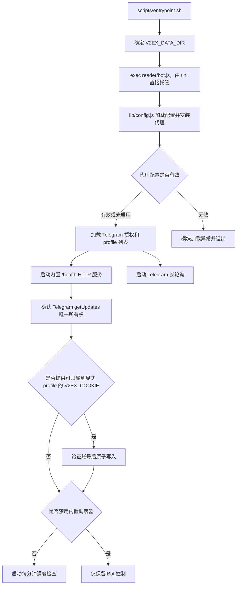
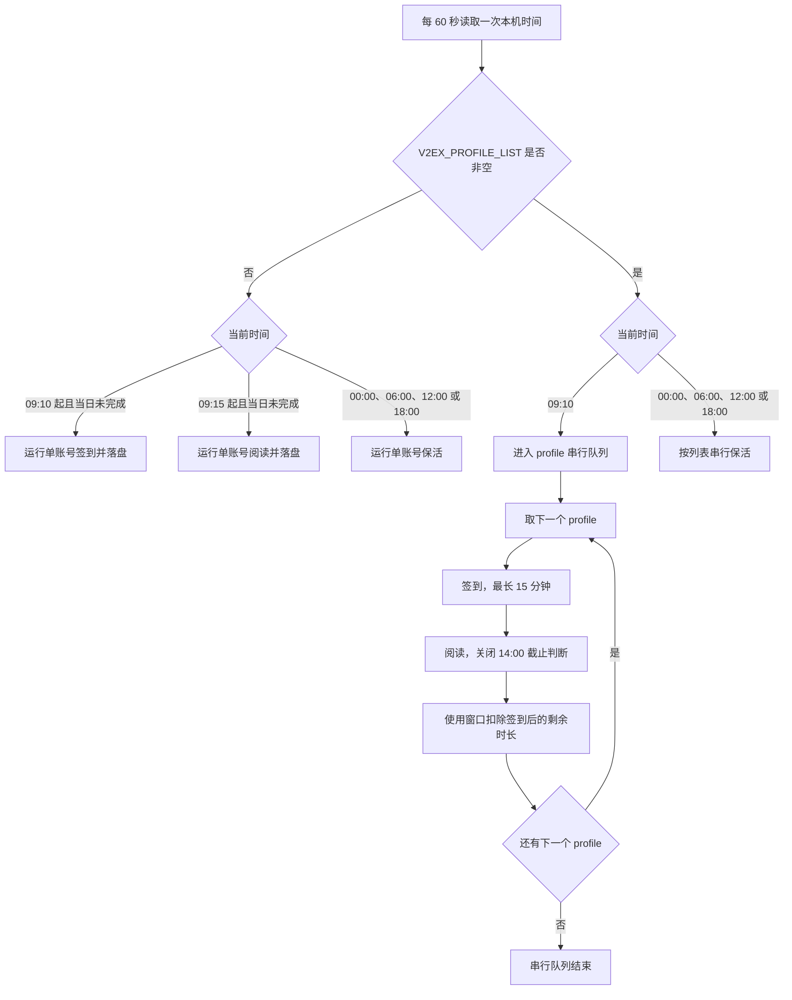
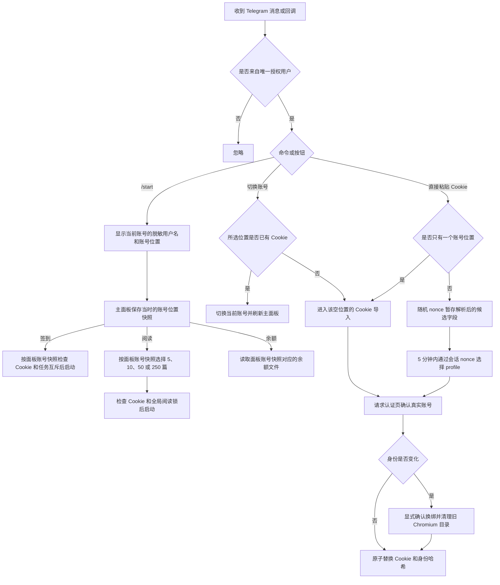
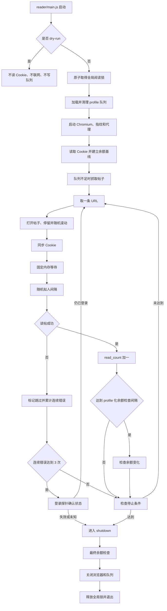

# V2EX Max Helper 实际流程图谱

本文依据当前 `mskatoni-patch-beta` 的 `v1.4.11` 代码绘制，用来回答“系统现在实际上怎样运行”。对应目标见 [设计流程图谱.md](设计流程图谱.md)。

## 容器启动路径

Docker Compose 当前使用 `TZ=${TZ:-Asia/Shanghai}`，因此 Node.js 的本机时间由容器 `TZ` 决定。容器只常驻一个 Node.js Bot 进程，健康检查复用 Bot 内置的受限 HTTP 服务。

## 实际自动调度

实际代码会等待固定窗口边界；每个窗口从本机时间 09:10 起依次计算，并同时覆盖签到和阅读。进度写入 `profile_schedule_state.json`，Bot 重启后会跳过已完成账号并从当前窗口恢复。

某个 profile 的签到或阅读返回非零状态时，循环仍会继续处理后续 profile，并在结束通知中逐项汇总。停止操作会设置序列取消状态、终止当前子进程，并阻止后续 profile 启动。

## 实际 Telegram 控制

`/sou`、`/checkin` 和 `/read [数量]` 默认操作当前账号，也可显式指定 profile；`/stop [profile]` 和 `/cookie [profile] [内容]` 保持兼容。回调使用短期会话 nonce 与账号下标，并保存创建面板时的账号快照；因此切换账号后点击旧面板，也不会误操作新账号。旧版未携带账号位置的主面板按钮会被拒绝并提示刷新。

## 实际阅读循环

实际停止条件包括：余额变化至少 2 次且已读至少 250 篇、达到有效篇数上限、达到本机 `14:00`、达到 `READ_MAX_RUNTIME_MS`，以及连续错误后的登录探针失败。带 `--limit` 的手动阅读会绕过 `14:00` 截止；多账号自动阅读显式设置运行时长并关闭该截止判断。

## 实际状态文件

| 状态 | `default` | 非默认 profile | 实际共享情况 |
|---|---|---|---|
| Cookie | `.v2ex_cookie` | `.v2ex_cookie.<profile>` | 隔离 |
| Chromium 目录 | `chrome-profile/default` | `chrome-profile/<profile>` | 隔离 |
| 余额记录 | `balance_log.json` | `balance_log.<profile>.json` | 隔离 |
| 余额状态 | `balance_status.json` | `balance_status.<profile>.json` | 隔离 |
| 队列 | `queue.db` | `queue.<profile>.db` | 隔离 |
| 指纹和行为参数 | profile 种子 | profile 种子 | 隔离 |
| 账号身份 | `profile_identity.json` | `profile_identity.<profile>.json` | 加盐哈希隔离，并保存脱敏显示提示 |
| 凭证锁 | `credential.default.lock` | `credential.<profile>.lock` | 按 profile 互斥 |
| Telegram 授权 | 同一文件 | 同一文件 | 共享 |
| 日志级别和综合日志 | 同一文件 | 同一文件 | 共享 |
| 阅读锁 | 同一临时锁文件 | 同一临时锁文件 | 共享 |

单账号直接运行时，显式 `COOKIE_FILE` 和 `DB_PATH` 仍优先。Bot 多账号子进程会删除这两个覆盖值及 `V2EX_COOKIE`，强制使用派生的 profile 路径。

## 设计与实际对比

| 对比项 | 设计目标 | 当前实际 | 结论 |
|---|---|---|---|
| profile 校验 | 仅允许字母、数字、下划线和连字符，最多 6 个 | `lib/config.js` 在路径拼接前校验并截断列表 | 一致 |
| 账号状态隔离 | Cookie、身份、浏览器、余额和队列按 profile 隔离 | 路径隔离、身份哈希和凭证事务均已接入 | 一致 |
| 全局互斥 | 同时最多一个阅读进程且任务可识别账号 | JSON 锁记录 PID、profile 和类型；每个 profile 另有凭证锁 | 一致 |
| 单账号调度 | 本机 09:10 签到，09:15 阅读 | 到点后补跑，并用 `profile_schedule_state.json` 防止重启重复 | 一致且更稳健 |
| 多账号时间分块 | 每个账号有计划开始边界和最长窗口 | 固定边界、签到耗时扣除、状态持久化和重启恢复已接入 | 一致 |
| 失败隔离 | 单个 profile 失败不阻塞后续账号 | 后续账号继续，最终逐 profile 汇总；停止则取消整条序列 | 一致 |
| Telegram 多账号控制 | 签到、阅读、余额、Cookie 均可选 profile | 面板使用短期会话 nonce + profile 下标，文本命令显式传 profile | 一致 |

> 上表的固定时间分块指 Bot 内置调度器。原生 systemd 的每 profile timer 共享全局阅读锁但不会排队，必须由部署者按最长运行时间错开。
| Cookie 暂存 | 独立事务、5 分钟、旧按钮不能串槽 | 随机 nonce 绑定候选与 profile 快照，过期后删除 | 一致 |
| 同账号任务冲突 | 阅读期间不能跳过当天签到 | 定时签到和保活等待凭证锁释放，最多 4 小时；Cookie 导入仍立即拒绝 | 一致 |
| 默认 8 秒下限 | 默认总等待不得低于 8000ms，显式配置可覆盖 | `reader/behavior.js` 按该规则补足 | 一致 |
| 代理安全 | 开启后无效配置必须拒绝启动 | 配置模块加载时抛出脱敏错误并退出，不会直连 | 一致，但错误以异常堆栈呈现 |
| 通知 HTTP 状态 | 非 2xx、超时和网络错误只记录脱敏告警 | Telegram 和飞书发送函数已检查 HTTP 状态 | 一致 |
| 正常阅读完成通知 | 正常结束应发送结果通知 | 非 dry-run 正常退出调用 `notifyReaderDone()` | 一致 |
| profile 失效提示 | 通知内容应指向当前 profile | 通知引导通过 Telegram 更新明确 profile | 一致 |
| 飞书范围 | 默认关闭，交互 Bot 只操作单个 `V2EX_PROFILE` | Webhook 和交互入口均需显式开启 | 一致 |
| Docker 时区 | 默认 `Asia/Shanghai` 且允许覆盖 | Compose 配置已修改并通过 YAML 解析 | 代码一致，容器未实测 |
| 版本状态 | 源代码版本字段保持统一 | tracked 版本字段为 1.4.11；部署状态以对应平台显示为准 | 一致 |

## 代码依据

| 模块 | 实际职责 |
|---|---|
| `lib/config.js` | profile 校验、路径派生、Telegram 和飞书配置 |
| `lib/profile-auth.js` | Cookie 候选解析、认证页验证、身份哈希和 Chromium 路径保护 |
| `lib/profile-lock.js` | JSON 任务锁、凭证锁和旧数字锁兼容 |
| `lib/profile-schedule.js` | 固定本机时段和 24 小时预算计算 |
| `lib/secure-proxy.js` | HTTP、HTTPS、SOCKS5 代理与本机或 LAN 主机限制 |
| `reader/bot.js` | Telegram 面板、命令、多账号串行、调度和任务互斥 |
| `reader/main.js` | 阅读主循环、停止条件、锁和退出清理 |
| `reader/browser.js` | Chromium、指纹、停留、滚动、Cookie 同步和间隔 |
| `reader/queue.js` | sql.js 队列及原子持久化 |
| `reader/balance.js` | 余额基线、变化检测和 profile 余额文件 |
| `checkin/v2ex-checkin.js` | 签到、保活、Cookie 续期和失败通知 |
| `scripts/entrypoint.sh` | Docker 进程编排；不直接读取或写入 Cookie |
