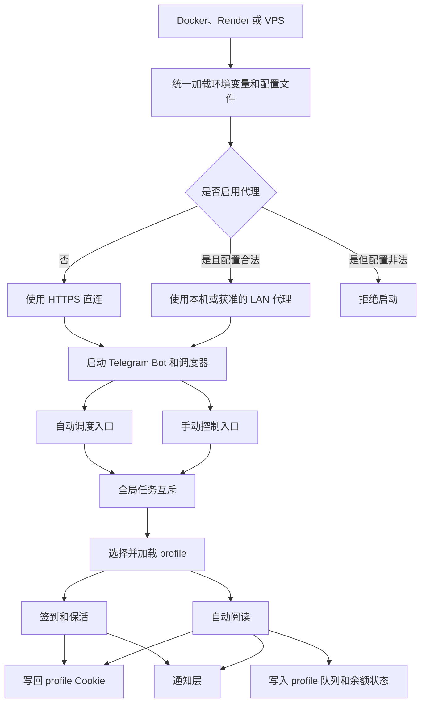
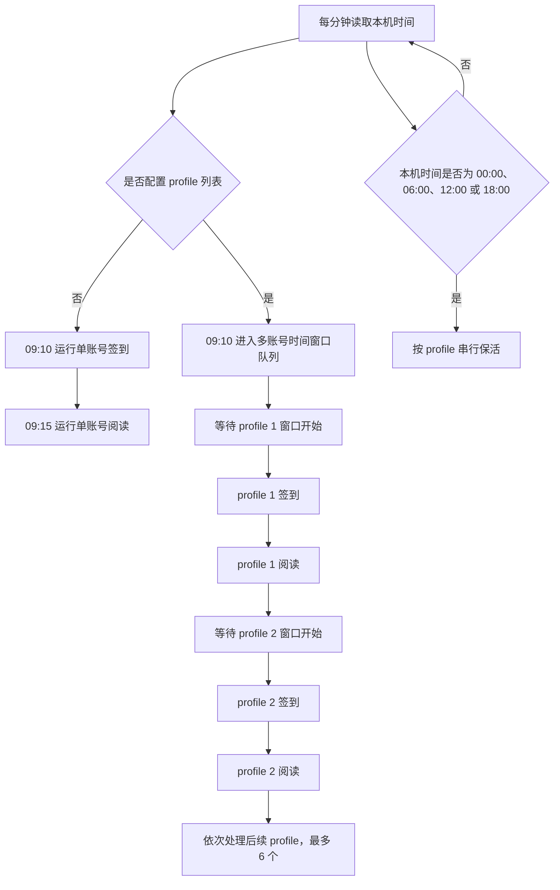
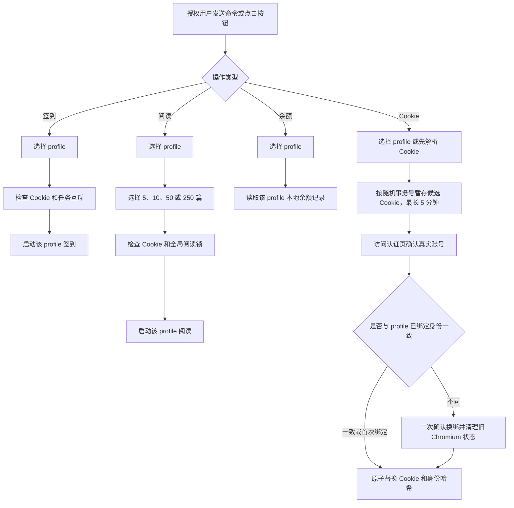
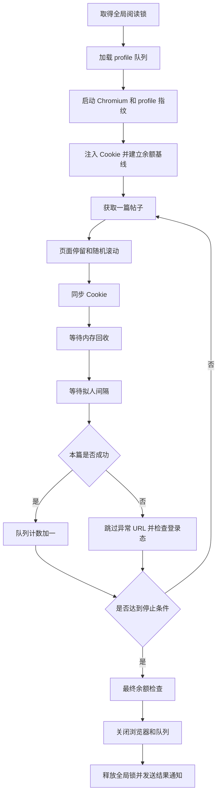

# V2EX Max Helper 设计流程图谱

本文描述 `v1.4.11` 的目标设计，用来回答“系统应该怎样运行”。真实代码路径和差异见 [实际流程图谱.md](实际流程图谱.md)。

## 设计原则

- 所有入口共用一套配置解析和 profile 命名规则。
- 最多管理 6 个 profile；账号状态隔离，控制状态共享。
- 同一时间最多运行一个阅读进程，多账号按时间窗口串行。
- 调度时间按运行环境的本机时区计算。
- 代理默认关闭；显式开启后配置错误必须拒绝启动，不能回退直连。
- Telegram 是主要控制面；飞书默认关闭，仅保留实验入口。

## 总体架构

## 自动调度设计

设计中的“时间窗口”表示每个 profile 有明确的计划开始边界和最长运行时长。前一个账号提前结束时，下一个账号仍应等到自己的窗口开始，避免所有账号在短时间内连续启动。

## Telegram 控制设计

只有一个可用 profile 时，应直接进入操作，不增加 profile 选择步骤。回调数据携带短期会话 nonce 和 profile 下标，不携带 profile 名或 Cookie；旧会话、列表重排和 Bot 重启后的按钮必须失效。

## 阅读任务设计

默认参数下，“最短拟人间隔 + 内存等待”不得低于 8000ms。用户显式设置最短间隔或内存等待时，视为高级覆盖。

## 状态边界

| 类型 | 按 profile 隔离 | 全局共享 |
|---|---|---|
| 登录状态 | Cookie、加盐账号身份哈希、Chromium 用户目录、凭证锁 | 无 |
| 阅读状态 | 队列数据库、余额记录、余额检查状态 | 阅读锁 |
| 行为身份 | 指纹、行为参数 | 无 |
| 控制状态 | 无 | Telegram 授权、日志级别、综合日志 |
| 调度状态 | profile 执行结果 | 固定窗口周期、取消状态 |
| 通知 | 消息中标明 profile | Telegram Chat ID、飞书配置 |

`default` 应继续使用旧文件名；非默认 profile 使用带名称的文件。无法确认归属的旧共享余额和队列保留给 `default`，不自动复制。

## 通知设计

通知层应覆盖 Cookie 失效、签到失败、余额变化、阅读异常和正常阅读完成。网络错误、超时或非 2xx 响应只记录脱敏状态，不得阻塞签到或阅读主流程。
